# Hey! I'm Gaurav 👨‍💻

<div align="center">
  
[](https://git.io/typing-svg)

</div>

<div align="center">
  
[](https://linkedin.com/in/devgauravgughane)
[](https://github.com/devgauravgughane)
[](mailto:devgauravgughane@gmail.com)

</div>

---

## 🎯 What I Do

I build **backend systems that don't break**. From high-load APIs to distributed architectures, I focus on creating server-side solutions that scale, perform, and actually work in production.

**Currently crafting** robust microservices, optimizing database queries, and making systems go *brrr* ⚡

---

## 🛠️ My Arsenal

<div align="center">

### **Core Stack**


### **Message & Cache**


### **Monitoring & Ops**


</div>

---

## 🚀 What I'm Building

<table>
<tr>
<td width="50%">

### 🏪 **Smart CRM Engine**
```java
@RestController
@RequestMapping("/api/v1/crm")
public class CRMController {
    
    @GetMapping("/leads")
    public ResponseEntity<List<Lead>> getLeads() {
        // 10K+ concurrent users
        // <100ms response time
        return ResponseEntity.ok(leadService.getAll());
    }
}
```
**Stack**: Spring Boot • PostgreSQL • Redis • Kafka  
**Handles**: 10,000+ concurrent users  
**Performance**: Sub-100ms API responses

</td>
<td width="50%">

### 🎬 **Stream Processing Platform**
```go
func (s *StreamService) ProcessVideo(ctx context.Context) error {
    // High-throughput video processing
    // CDN integration
    // Real-time analytics
    return s.processStream(ctx)
}
```
**Stack**: Go • MongoDB • CDN • WebSockets  
**Features**: Real-time streaming, analytics  
**Scale**: Handles massive video uploads

</td>
</tr>
<tr>
<td>

### 🍔 **Order Management System**
```go
type OrderProcessor struct {
    kafka   *kafka.Producer
    redis   *redis.Client
    db      *sql.DB
}

func (op *OrderProcessor) ProcessOrder(order Order) {
    // McDonald's-style flow
    // Real-time order tracking
    // Payment integration
}
```
**Stack**: Go • Kafka • PostgreSQL • Redis  
**Features**: Real-time tracking, payment flow  
**Architecture**: Event-driven microservices

</td>
<td>

### ⚡ **Rate Limiter Service**
```go
func (rl *RateLimiter) Allow(ctx context.Context, key string) bool {
    // Token bucket algorithm
    // Distributed rate limiting
    // Sub-millisecond response
    return rl.checkLimit(ctx, key)
}
```
**Stack**: Go • Redis • gRPC  
**Performance**: Sub-millisecond decisions  
**Use Case**: API gateway protection

</td>
</tr>
</table>

---

## 📊 GitHub Insights

<div align="center">
  
[](https://github.com/devgauravgughane)
[](https://github.com/devgauravgughane)

</div>

---

## 🎯 My Focus Areas

```mermaid
graph TD
    A[🚀 Backend Engineering] --> B[REST API Design]
    A --> C[Microservices Architecture]
    A --> D[Performance Optimization]
    
    B --> E[Spring Boot APIs]
    B --> F[Go HTTP Services]
    
    C --> G[Event-Driven Systems]
    C --> H[Service Mesh]
    
    D --> I[Database Tuning]
    D --> J[Caching Strategies]
    
    style A fill:#00D4FF,stroke:#0099CC,stroke-width:3px,color:#000
    style B fill:#FF6B35,stroke:#CC5429,stroke-width:2px,color:#fff
    style C fill:#6DB33F,stroke:#5A9332,stroke-width:2px,color:#fff
    style D fill:#E6522C,stroke:#B8421F,stroke-width:2px,color:#fff
```

<div align="center">



</div>

---

## 🔥 Skills Matrix

<div align="center">
<table>
<tr>
<td align="center" width="50%">

### **🎯 Expert Level**
- **Java Ecosystem**: Spring Boot, Hibernate, JPA
- **Database Design**: PostgreSQL, MongoDB, Redis
- **REST APIs**: Design, versioning, documentation
- **Security**: JWT, OAuth2, Spring Security
- **Performance**: JVM tuning, query optimization

</td>
<td align="center" width="50%">

### **⚡ Advanced Level**
- **Go Programming**: Concurrency, microservices
- **Message Queues**: Kafka, RabbitMQ, pub-sub
- **Monitoring**: Prometheus, Grafana, logging
- **System Design**: Distributed systems, scalability
- **Docker**: Containerization, multi-stage builds

</td>
</tr>
</table>
</div>

---

## 🌟 Current Vibe

<div align="center">

```ascii
     ╔═══════════════════════════════════════╗
     ║  🚀 Building high-performance APIs    ║
     ║  ⚡ Optimizing database queries      ║
     ║  🎯 Mastering Go concurrency         ║
     ║  📊 Implementing observability       ║
     ║  🔧 Designing scalable systems       ║
     ╚═══════════════════════════════════════╝
```

</div>

---

## 🎪 Fun Facts

<div align="center">

| 🎯 **Code Philosophy** | 🚀 **Current Mission** | ⚡ **Performance Goal** |
|:---:|:---:|:---:|
| *"Make it work, make it right, make it fast"* | Building systems that scale | Sub-100ms API responses |

</div>

---

## 📈 Let's Connect!

<div align="center">

**Always down for:**
- 🤖 Backend architecture discussions
- ⚡ Performance optimization chats
- 🚀 System design brainstorming
- 💡 Open source collaborations

**Hit me up if you're into:**
- High-performance systems
- Microservices architecture
- Database optimization
- Go concurrency patterns

</div>

---

<div align="center">

### 💭 *"Code is poetry, but backend code is the foundation that makes the poetry possible"*


---

## 📄 License

[](https://www.gnu.org/licenses/agpl-3.0)

</div>
